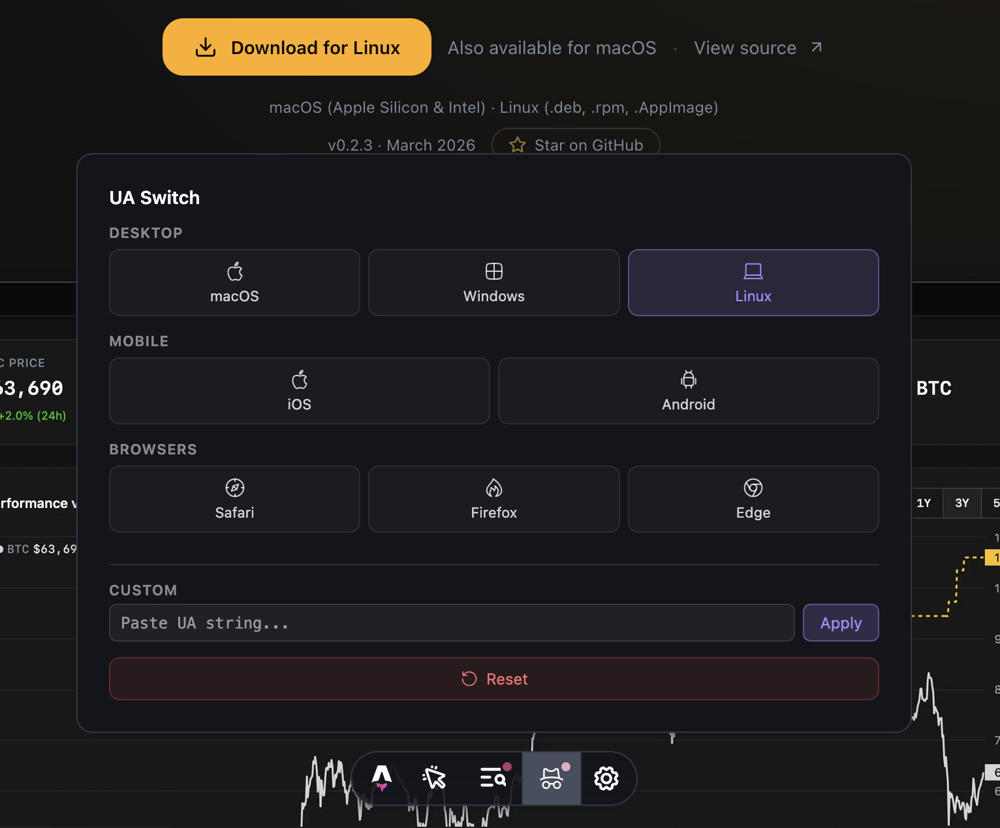

# astro-toolbar-ua

[](https://github.com/guillevc/astro-toolbar-ua)
[](https://www.npmjs.com/package/astro-toolbar-ua)
[](LICENSE)

Test platform detection and browser-specific behavior without leaving your browser — switch user agent strings directly from the Astro dev toolbar.



## Install

Need to check how your site behaves on iOS, Android, or Safari? Add it in one command:

```sh
# npm
npx astro add astro-toolbar-ua

# pnpm
pnpm astro add astro-toolbar-ua

# yarn
yarn astro add astro-toolbar-ua
```

Or install manually:

```sh
npm install -D astro-toolbar-ua
```

```js
// astro.config.mjs
import { defineConfig } from "astro/config";
import toolbarUA from "astro-toolbar-ua";

export default defineConfig({
  integrations: [toolbarUA()],
});
```

## Usage

Open the **UA Switch** panel in the Astro dev toolbar. Pick a preset or paste a custom UA string. The page reloads with the new user agent applied.

A notification dot appears on the toolbar icon when a UA override is active.

### Presets

| Category     | Presets               |
| ------------ | --------------------- |
| **Desktop**  | macOS, Windows, Linux |
| **Mobile**   | iOS, Android          |
| **Browsers** | Safari, Firefox, Edge |

You can also enter any custom UA string directly.

## How it works

1. A synchronous `<head>` script reads a `localStorage` key and overrides `navigator.userAgent` via `Object.defineProperty` — before any page scripts run
2. The toolbar UI writes the selected UA string to `localStorage` and reloads the page
3. Only runs during `astro dev` — production builds are not affected

## Good to know

- Only overrides client-side `navigator.userAgent`. Does not modify server-side request headers.
- `Object.defineProperty` on `navigator.userAgent` works in Chromium and Firefox. Safari may not support it in all versions.

## Support

If you find this useful, [star the repo on GitHub](https://github.com/guillevc/astro-toolbar-ua) — it helps others discover it.

## License

MIT
